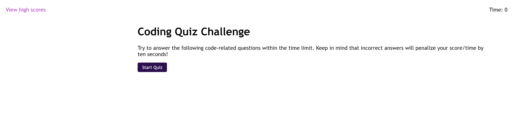
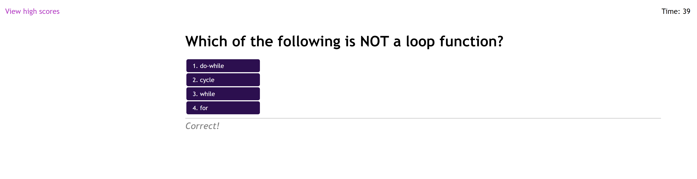
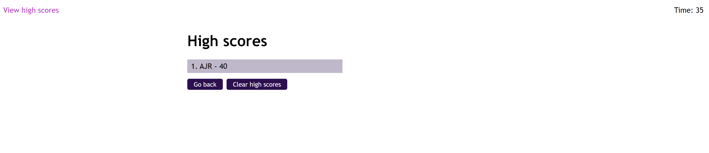

# Coding Quiz
Complete a quiz of questions supplied from file. User has a certain amount of time to finish (number of questions * 8 seconds), and every incorrect answer subtracts 10 seconds from overall time.
  
User may then add their score to a list of local high scores. Score is calculated by: 
Amount of time left + number of questions answered correctly
 

## 📝 Features
 - Easy to add and change questions and answers: all in a separate JavaScript file
 - Save and load scores from local storage
 - All questions and answers are listed in a random order; every quiz won't be the same
 - Ability to clear high scores from local storage
 - Error handling for buttons and user attempts to clear storage with nothing in it

## 🚧 TO-DO
 - Add ability to view high scores at any point
 - Add limits to how many high scores that can be saved (top 15)
 - Add visual for time being subtracted
 - Add error checking for how long initials can be

## 🔑 How to access
The code base can be cloned from the GitHub repo [here](https://github.com/mpityo/Coding-Quiz).
 
The website may be viewed on GitPages [here](https://mpityo.github.io/Coding-Quiz/)
 

## 🏆 Credit
Page design and JavaScript built from scratch by yours truly, @mpityo
 
Design built off images supplied by UCF Boot Camp: ([Git Hub](https://github.com/UCF-Coding-Boot-Camp/UCF-VIRT-BO-FSF-PT-12-2021-U-B))
 
 
Project is fully open source: explore the code and upgrade away!
 
 

